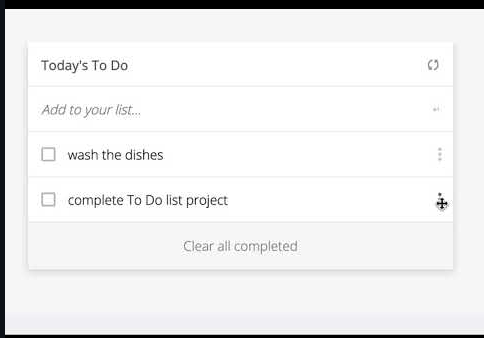

# ToDoList
Build a simple HTML list of To Do tasks that will be built using webpack and served by a webpack dev server.



## Built With

- Java Script
- Webpack

## Live Demo

[Live Demo Link](https://marilirulita.github.io/ToDoList/)

## Getting Started

- Run this command in your OS terminal to get a copy of the project:

  ```
  git@github.com:marilirulita/ToDoList.git
  ```

- Open the folder project from your code editor.

- Run:

  ```
  npm install
  ```
  
- From the root folder run start command to see the project on browser: 

  ```
  npm start
  ```

### Setup

* Clone the repository in order to get a copy of this project

## Authors

#### Mar Bautista
GitHub: [marilirulita](https://github.com/marilirulita)

LinkedIn: [mar bautista](https://www.linkedin.com/in/marbautista/)

Twitter: [@marylirulita](https://twitter.com/marylirulita)

## 🤝 Contributing

Contributions, issues, and feature requests are welcome!

Feel free to check the [issues page](https://github.com/marilirulita/ToDoList/issues).

## Show your support

Give a ⭐️ if you like this project!

## 📝 License

This project is [MIT](LICENSE) licensed.
